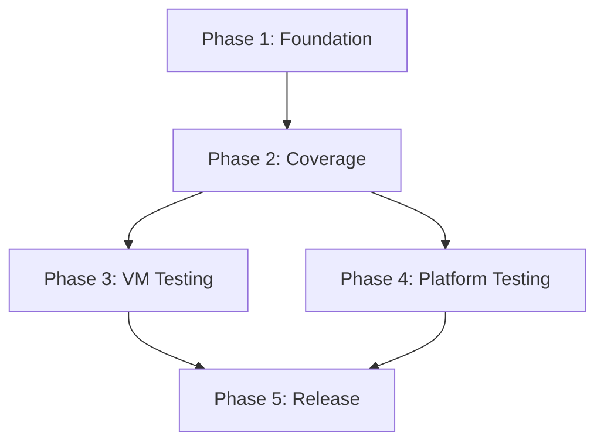

# Test Requirements Document (TRD)
## wolskies.infrastructure Ansible Collection

**Document Version:** 1.0
**Collection Version:** 1.2.0 (Target)
**Last Updated:** September 22, 2025
**Status:** Draft

---

## Table of Contents

1. [Test Strategy Overview](#1-test-strategy-overview)
2. [Test Implementation](#2-test-implementation)
3. [Test Environment](#3-test-environment)
4. [Test Execution](#4-test-execution)
5. [Quality Management](#5-quality-management)
6. [Implementation Roadmap](#6-implementation-roadmap)

---

## Document Purpose

This document defines the test strategy, environment, and execution process for the wolskies.infrastructure collection v1.2.0. It establishes the testing methodology and implementation approach, with detailed requirement validation defined in the separate Requirement Validation Plan.

---

## 1. Test Strategy Overview

### 1.1 Test Philosophy

**Core Principles:**
- **Individual role tests are authoritative** - Each role must have comprehensive tests that validate its specific functionality
- **No test-specific production code** - Never add `when: not molecule_test` conditionals or similar test accommodations to production code
- **Semantic failures over masking** - Let roles fail properly rather than masking issues with test workarounds
- **Progressive testing approach** - Each test phase should catch issues before the next phase

**Testing Contract:**
> Individual role tests are the definitive validation of functionality. If role tests pass but integration fails, this indicates missing role test coverage, not integration code issues.

### 1.2 Test Hierarchy

**Phase I: Development Testing (Required before any commit)**
1. `ansible-lint` - Syntax and standards validation
2. `molecule converge` - Role functionality testing during development
3. `molecule test` - **MUST PASS** - Full test suite including verification
4. `pre-commit` - Formatting, linting, custom hooks

**Phase II: CI Testing (Automated)**
- Individual role tests (parallel execution)
- Integration testing
- Discovery validation
- Minimal scenario testing

**Phase III: VM Testing (Comprehensive validation)**
- Full platform matrix testing
- Real-world scenario validation
- Edge case testing
- Performance validation

### 1.3 Test Types by Role Complexity

**Simple Roles** → Individual role tests (`roles/{role-name}/molecule/default/`)
- Focus: Role-specific functionality, packages, configuration
- Examples: nodejs, rust, go, os_configuration, manage_packages

**Orchestrating Roles** → Integration tests (`molecule/test-integration/`)
- Focus: Role interactions, cross-dependencies, end-to-end workflows
- Examples: configure_system (calls multiple roles)

**Cross-cutting Concerns** → Specialized test suites
- Discovery validation
- Security hardening verification
- Platform compatibility

---

## 2. Test Implementation

### 2.1 Molecule Testing Methodology

#### 2.1.1 Core Principles for State-Based Validation

**✅ DO: State-Based Validation**
- **Purpose**: Validate that the system is in the expected state after role execution
- **Approach**: Use commands like `hostname`, `timedatectl`, `localectl`, `grep` to check actual system state
- **Example**: After hostname role runs, check `hostname` command output matches expected value
- **Benefit**: Tests real functionality, not just task execution

**❌ DON'T: Task Logic Reimplementation**
- **Problem**: Duplicating production logic in verify.yml (e.g., re-running `ansible.builtin.hostname`)
- **Issues**: Creates maintenance burden, doesn't test actual outcomes, can mask production bugs
- **Example**: Don't run `ansible.builtin.hostname` in verify.yml when testing hostname role
- **Solution**: Check system state with `hostname` command instead

#### 2.1.2 Environment-Aware Testing Strategy

**Container Environment (CI/Primary)**:
- **Purpose**: Validate conditional logic and variable handling
- **Limitations**: Hostname, timezone, locale changes may not persist due to Docker restrictions
- **Approach**: Skip problematic assertions, document limitations with warning messages
- **Detection**: Use `ansible_virtualization_type != "docker"` conditional

**VM Environment (Phase 3/Complete)**:
- **Purpose**: End-to-end functionality validation on realistic target systems
- **Capabilities**: Full system state changes, persistent configuration
- **Approach**: Complete state validation including actual system changes

#### 2.1.3 Verification Pattern Template

**For each requirement, verify.yml should check:**

1. **Initial State**: Document the baseline system state before role execution
2. **Expected Outcome**: Define exactly what system state should result from each scenario
3. **Verification Commands**: Specify the exact commands used to validate the outcome
4. **Conditional Logic**: Validate that the right scenarios trigger/skip based on variables

**Standard Pattern**:
```yaml
# 1. Capture current state
- name: Get current hostname
  ansible.builtin.command: hostname
  register: current_hostname

# 2. Validate expected outcome based on scenario
- name: Verify hostname set correctly (positive case - VM/bare metal)
  ansible.builtin.assert:
    that: current_hostname.stdout == "expected-value"
  when:
    - inventory_hostname in ['positive-test-case']
    - ansible_virtualization_type != "docker"

# 3. Document container limitation (positive case)
- name: Document hostname limitation in containers
  ansible.builtin.debug:
    msg: "⚠️ REQ-XX-XXX: Validation skipped in container - will be validated in VM testing"
  when:
    - inventory_hostname in ['positive-test-case']
    - ansible_virtualization_type == "docker"

# 4. Validate conditional logic (negative cases)
- name: Verify hostname unchanged (negative case)
  ansible.builtin.debug:
    msg: "✅ Hostname correctly unchanged - conditional logic working"
  when: inventory_hostname in ['negative-test-case']
```

#### 2.1.4 Container Limitation Handling

**Standard Pattern**: For each requirement that may fail in containers:
```yaml
# VM/Bare metal validation
- name: Full validation (VM/bare metal only)
  ansible.builtin.assert:
    that: # actual validation logic
  when: ansible_virtualization_type != "docker"

# Container limitation documentation
- name: Document container limitation
  ansible.builtin.debug:
    msg: "⚠️ REQ-XX-XXX: Validation skipped in container - will be validated in VM testing"
  when: ansible_virtualization_type == "docker"
```

**Benefits**:
- CI tests pass consistently (no false failures)
- Clear documentation of what's tested where
- No environment-specific test workarounds
- Comprehensive validation in appropriate environments

### 2.2 Test Scenarios

The collection uses four test scenario complexity levels to validate functionality progressively. Each scenario builds upon the previous level to ensure comprehensive coverage:

#### 2.1.1 Scenario Complexity Levels

**Minimal Test (`minimal-test.yml`)**:
```yaml
# Validates core functionality with minimum configuration
host_hostname: "test-minimal"
domain_timezone: "UTC"
users:
  - name: testuser
    state: present
packages:
  present:
    all:
      ubuntu: ["curl", "git"]
      arch: ["curl", "git"]
```

**Confidence Test (`confidence-test.yml`)**:
```yaml
# Standard deployment validation
host_hostname: "test-confidence"
domain_timezone: "America/New_York"
domain_locale: "en_US.UTF-8"
host_update_hosts: true

users:
  - name: devuser
    groups: ["users"]
    shell: "/bin/bash"
    ssh_keys:
      - "ssh-ed25519 AAAAC3... devuser@example"
    git:
      user_name: "Dev User"
      user_email: "dev@example.com"
    nodejs:
      packages: ["npm"]

packages:
  present:
    all:
      ubuntu: ["curl", "git", "vim", "htop", "build-essential"]
      arch: ["curl", "git", "vim", "htop", "base-devel"]

firewall:
  enabled: true
  rules:
    - port: 22
      protocol: tcp
      rule: allow
```

**Comprehensive Test (`comprehensive-test.yml`)**:
```yaml
# Full feature and edge case validation
host_hostname: "test-comprehensive"
domain_timezone: "America/New_York"
domain_locale: "en_US.UTF-8"
domain_language: "en_US.UTF-8"
host_update_hosts: true

users:
  # Developer with all language toolchains
  - name: devuser
    uid: 1001
    groups: ["users", "docker"]
    shell: "/bin/bash"
    ssh_keys:
      - "ssh-ed25519 AAAAC3... devuser@example"
    superuser: true
    sudo:
      nopasswd: false
    git:
      user_name: "Dev User"
      user_email: "dev@example.com"
      editor: "vim"
    nodejs:
      packages: ["typescript", "@angular/cli", "npm"]
    rust:
      packages: ["ripgrep", "fd-find"]
    go:
      packages: ["github.com/junegunn/fzf@latest"]
    neovim:
      enabled: true
    terminal_entries:
      - type: "gnome-terminal"
        key: "default-show-menubar"
        value: "false"

  # Power user with custom sudo
  - name: poweruser
    uid: 1002
    shell: "/bin/zsh"
    superuser: true
    sudo:
      nopasswd: true
    ssh_keys:
      - "ssh-rsa AAAAB3... poweruser@example"
      - "ssh-ed25519 AAAAC3... poweruser@backup"

  # Restricted user
  - name: restricteduser
    uid: 1003
    shell: "/bin/sh"
    groups: []

  # Service account
  - name: serviceacct
    uid: 999
    system: true
    shell: "/bin/false"
    home: "/var/lib/serviceacct"
    create_home: false

packages:
  present:
    all:
      ubuntu: ["curl", "git", "vim", "htop", "build-essential", "python3-pip"]
      arch: ["curl", "git", "vim", "htop", "base-devel", "python-pip"]
    host:
      ubuntu: ["docker.io", "postgresql", "nginx"]
      arch: ["docker", "postgresql", "nginx"]
  remove:
    all:
      ubuntu: ["nano", "snapd"]
      arch: ["nano"]

firewall:
  enabled: true
  prevent_ssh_lockout: true
  rules:
    - port: 22
      protocol: tcp
      rule: allow
      comment: "SSH access"
    - port: 80
      protocol: tcp
      rule: allow
      comment: "HTTP"
    - port: 443
      protocol: tcp
      rule: allow
      comment: "HTTPS"
    - port: 5432
      protocol: tcp
      rule: allow
      from_ip: "192.168.1.0/24"
      comment: "PostgreSQL local"

host_security:
  hardening_enabled: true
  ssh_hardening_enabled: true

host_sysctl:
  parameters:
    net.ipv4.ip_forward: 1
    vm.swappiness: 10
```

#### 2.1.2 Edge Case Test Specifications

**Edge Case Test (`edge-case-test.yml`)**:
```yaml
# Boundary conditions and error scenarios
users:
  # Maximum length username (32 chars)
  - name: "this_is_a_very_long_username_32c"
    state: present

  # Username with special characters
  - name: "user-with-dash_and_underscore"
    state: present

  # User deletion test
  - name: "deleteme"
    state: absent

  # Duplicate UID test (should handle gracefully)
  - name: "uid_conflict_1"
    uid: 2001
  - name: "uid_conflict_2"
    uid: 2001  # Intentional conflict

  # Empty/invalid shell test
  - name: "noshelluser"
    shell: ""

  # Large SSH key list
  - name: "manykeys"
    ssh_keys: # 10+ keys to test performance
      - "ssh-rsa AAAAB3... key1"
      - "ssh-rsa AAAAB3... key2"
      # ... up to 10 keys

packages:
  present:
    all:
      ubuntu:
        # Non-existent package (should handle gracefully)
        - "this-package-does-not-exist-12345"
        # Very long package list (100+ packages)
        - "package1"
        - "package2"
        # ... up to 100 packages

firewall:
  rules:
    # Overlapping rules
    - port: 8080
      rule: allow
    - port: 8080
      rule: deny  # Conflict

    # Invalid port ranges
    - port: 70000  # Out of range
      rule: allow

    # Complex CIDR notation
    - port: 9000
      from_ip: "10.0.0.0/8"
```

### 2.2 Requirement Validation Plan

Detailed validation for each of the 89 SRD requirements is defined in the **Requirement Validation Plan** document. This comprehensive plan provides:

- **Positive tests** - Verify requirements work as designed
- **Negative tests** - Verify security filtering and error handling
- **Exact verification commands** with expected outputs
- **Platform-specific variations** for Ubuntu, Arch, and macOS
- **Container vs VM testing** classifications

The validation plan ensures every requirement has specific, actionable test cases with precise verification methods.

**Key Validation Areas:**
- User management and privilege escalation security (18 requirements)
- Package management across platforms (15 requirements)
- System configuration and hardening (28 requirements)
- Security services and firewall management (12 requirements)
- Development environment setup (10 requirements)
- Platform-specific configurations (6 requirements)

**Container Testing Limitations:**
Some requirements cannot be tested in containers and require VM testing:
- Hostname changes
- NTP/time synchronization
- Firewall rule application
- System upgrades
- Terminal emulator configuration
- systemd service management

---

## 3. Test Environment

### 3.1 Development Environment

**Local Testing Requirements**

**Requirements**:
- Ansible 2.17+ with molecule support
- Container runtime (Docker/Podman) for molecule tests
- `ANSIBLE_HASH_BEHAVIOUR=merge` environment configuration
- Collection dependencies from `requirements.yml`

**Setup Validation**:
```bash
cd roles/{role-name}
molecule converge  # Must work without errors
molecule test     # Must pass completely
```

### 3.2 CI Environment

**CI Pipeline Requirements**

**Requirements**:
- Ubuntu latest runners with Docker support
- Parallel job execution capability
- Ansible and molecule pre-installed
- Collection dependency management

**Matrix Configuration**:
```yaml
strategy:
  matrix:
    test_target:
      - nodejs
      - rust
      - go
      - neovim
      - terminal_config
      - test-integration
      - test-discovery
      - test-minimal
```

### 3.3 VM Test Environment

**VM Infrastructure Requirements**

**Infrastructure Requirements**:
- OpenTofu/Terraform for IaC management
- libvirt with bridged networking (br0)
- Cloud image support (Ubuntu, Arch)
- SSH key-based access as `ed` user

**VM Configuration Matrix**:
```yaml
vm_targets:
  ubuntu2204:
    image: "jammy-server-cloudimg-amd64.img"
    os_family: "Debian"
  ubuntu2404:
    image: "noble-server-cloudimg-amd64.img"
    os_family: "Debian"
  archlinux:
    image: "Arch-Linux-x86_64-cloudimg.qcow2"
    os_family: "Archlinux"
```

**Test User Matrix**:
```yaml
test_users:
  devuser:        # Standard developer with full toolchain
  poweruser:      # Power user with advanced shell/tools
  restricteduser: # Minimal/restricted user
  serviceacct:    # Service account
```

---

## 4. Test Execution

### 4.1 Local Development Workflow

**Standard Development Testing**:
```bash
# 1. Syntax and standards validation
ansible-lint

# 2. Role functionality testing
cd roles/{role-name}
molecule converge

# 3. Full test suite (REQUIRED before commit)
molecule test

# 4. Pre-commit validation
pre-commit run --all-files
```

**Critical Rule**: `molecule test` failure = commit blocked

### 4.2 CI Pipeline Stages

**Stage 1: Parallel Role Testing**
```yaml
jobs:
  test-roles:
    strategy:
      matrix:
        role: [nodejs, rust, go, neovim, terminal_config]
    steps:
      - name: Test individual role
        run: cd roles/${{ matrix.role }} && molecule test
```

**Stage 2: Integration Testing**
```yaml
jobs:
  test-integration:
    needs: test-roles
    steps:
      - name: Test role interactions
        run: cd molecule/test-integration && molecule test
```

**Stage 3: Discovery & Validation**
```yaml
jobs:
  test-discovery:
    needs: test-roles
    steps:
      - name: Test discovery validation
        run: cd molecule/test-discovery && molecule test
```

### 4.3 VM Test Procedures

**Phase I: Infrastructure Provisioning**
```bash
# 1. VM creation with OpenTofu
cd vm-test-infrastructure/phase1-local-linux/terraform
tofu apply -auto-approve

# 2. Connectivity validation
ansible all -i inventory.ini -m ping
```

**Phase II: System Configuration**
```bash
# 3. Full system deployment
ansible-playbook -i inventory.ini \
  configure_system.yml \
  --extra-vars "@test-scenarios/comprehensive-test.yml"
```

**Phase III: Validation**
```bash
# 4. Discovery and validation
ansible-playbook -i inventory.ini \
  validate_vm_configuration.yml \
  --extra-vars "@test-scenarios/comprehensive-test.yml"
```

**Validation Strategy**: Compare discovery playbook results against expected configuration inputs to ensure:
- All users created with correct properties
- All packages installed and functional
- All services enabled and running
- All firewall rules applied correctly
- All security hardening measures active

### 4.4 Test Data Management

**Test Scenarios**:
- `confidence-test.yml` - Basic functionality validation
- `comprehensive-test.yml` - Full feature testing with edge cases
- `minimal-test.yml` - Minimal configuration testing
- `edge-case-test.yml` - Boundary and error condition testing

**Expected Results Storage**:
- VM validation results: `/tmp/validation_results_*.yml`
- Test artifacts preserved for 7 days
- Failed test logs captured and stored

## 5. Quality Management

### 5.1 Performance Metrics

**Performance Targets**:
- Individual role tests: < 5 minutes each
- Integration tests: < 10 minutes
- Full CI pipeline: < 15 minutes
- VM test suite: < 30 minutes

**Quality Metrics**:
- Test coverage: 100% of SRD requirements
- Test reliability: 99%+ pass rate on clean commits
- False positive rate: < 1%

**Monitoring**:
- Test execution time tracking
- Flaky test identification and resolution
- Coverage gap analysis and remediation

### 5.2 Failure Classification

**Critical Failures (Block v1.2.0 Release)**:
```yaml
criteria:
  - User account creation/deletion failures
  - Package installation failures on supported platforms
  - Security misconfigurations (firewall, sudo, SSH)
  - Data loss scenarios
  - Role execution failures
action: MUST FIX before any release
examples:
  - "REQ-CU-001: User creation fails on Ubuntu"
  - "REQ-MP-007: Core packages fail to install"
  - "REQ-SS-001: Firewall rules not applied"
```

**Major Failures (Fix in Next Sprint)**:
```yaml
criteria:
  - Platform-specific edge cases
  - Non-essential service failures
  - Performance degradation >10%
  - Integration test failures (if role tests pass)
action: Document in known issues, fix in v1.2.1
examples:
  - "REQ-OS-008: NTP sync fails on specific cloud provider"
  - "REQ-CU-011: Terminal config fails for obscure terminal"
  - "Integration test timeout on slow systems"
```

**Minor Failures (Document as Known Issues)**:
```yaml
criteria:
  - Cosmetic issues
  - Non-blocking warnings
  - Performance degradation <10%
  - Test-only issues (not affecting production)
action: Document in release notes, fix when convenient
examples:
  - "Deprecation warnings from Ansible modules"
  - "Test cleanup leaves temporary files"
  - "Idempotency warning on second run"
```

### 5.3 Failure Deferral Process

**Decision Tree for Test Failures**:
```
Test Failure Detected
    ├── Is it reproducible?
    │   ├── No → Mark as flaky, investigate infrastructure
    │   └── Yes → Continue classification
    │
    ├── Does it affect production code?
    │   ├── No → Minor (test-only issue)
    │   └── Yes → Continue classification
    │
    ├── Does it break core functionality?
    │   ├── Yes → Critical (must fix)
    │   └── No → Continue classification
    │
    ├── Is it platform-specific?
    │   ├── Yes, affects primary platform → Major
    │   └── Yes, affects edge platform → Minor
    │
    └── Default → Major (investigate further)
```

**Deferral Documentation Requirements**:
```yaml
# Each deferred failure must have:
failure_record:
  id: "FAIL-2025-001"
  requirement: "REQ-OS-028"
  description: "Keyboard layout fails on macOS 14+"
  classification: "major"
  discovered: "2025-09-22"
  environment: "macOS 14.5, Ansible 2.17"

  reproduction_steps:
    - "Set macos.keyboard.layout: 'dvorak'"
    - "Run configure_user role"
    - "Observe failure in osx_defaults module"

  workaround: "Manually set keyboard layout post-deployment"

  fix_plan:
    target_version: "v1.2.1"
    approach: "Update osx_defaults parameters for macOS 14"
    assigned_to: "TBD"

  impact_assessment:
    users_affected: "~5% (macOS users with non-US keyboards)"
    severity: "medium"
    business_impact: "low"
```

### 5.4 Known Issues Tracking

**Location**: `docs/KNOWN_ISSUES.md`

**Format**:
```markdown
## Known Issues - v1.2.0

### Critical Issues
None - all critical issues resolved before release

### Major Issues
- **FAIL-2025-001**: macOS keyboard layout configuration
  - Impact: macOS 14+ users
  - Workaround: Manual configuration
  - Fix target: v1.2.1

### Minor Issues
- **FAIL-2025-002**: Deprecation warning in community.general 7.x
  - Impact: Log noise only
  - Workaround: Suppress warnings
  - Fix target: v1.3.0
```

### 5.5 Test Flakiness Management

**Flaky Test Handling**:
```yaml
flaky_test_policy:
  detection:
    - Test passes/fails inconsistently
    - No code changes between runs
    threshold: "Fails >1 time in 10 runs"

  response:
    immediate:
      - Add retry mechanism (max 3 attempts)
      - Increase timeouts if timing-related
      - Add wait conditions if race condition

    investigation:
      - Identify root cause (timing, resources, external deps)
      - Document in test comments
      - Track pattern across multiple tests

    resolution:
      - Fix root cause if possible
      - Move to VM-only testing if container issue
      - Defer to manual testing if unfixable
```

---

## 6. Implementation Roadmap

### 6.1 Phase 1: Foundation (Week 1-2) - CURRENT

**Priority: Fix existing test gaps**

| Task | SRD Requirements | Status | Blocker |
|------|------------------|--------|---------|
| Fix configure_user role tests | REQ-CU-001 to REQ-CU-013 | 🔄 In Progress | None |
| Update os_configuration tests for new requirements | REQ-OS-001 to REQ-OS-008 | 🔄 Planned | None |
| Add test scenario files | Test scenarios | 🔄 Planned | None |
| Create verify.yml templates | All roles | 🔄 Planned | None |

**Exit Criteria**:
- All existing role tests pass with new SRD requirements
- Test scenario files created and validated
- CI pipeline green

### 6.2 Phase 2: Coverage Expansion (Week 3-4)

**Priority: Achieve 100% container-testable coverage**

| Task | SRD Requirements | Dependencies |
|------|------------------|--------------|
| Add missing manage_packages tests | REQ-MP-001 to REQ-MP-012 | Phase 1 complete |
| Add manage_security_services tests | REQ-SS-001 to REQ-SS-007 | Phase 1 complete |
| Implement edge case scenarios | Test scenarios | Test scenarios ready |
| Integration test updates | Integration testing | Role tests complete |

**Exit Criteria**:
- 100% coverage of container-testable requirements
- Edge case scenarios implemented
- Integration tests updated for new requirements

### 6.3 Phase 3: VM Testing Infrastructure (Week 5-6)

**Priority: Enable comprehensive real-world testing**

| Task | Requirements | Dependencies |
|------|--------------|--------------|
| Setup OpenTofu/libvirt infrastructure | VM testing | Infrastructure access |
| Create VM test playbooks | VM testing | Terraform ready |
| Implement validation playbook | Discovery role | VM infrastructure |
| Test all VM-only requirements | See Requirement Validation Plan | VMs operational |

**Exit Criteria**:
- VM infrastructure operational
- All VM-only requirements tested
- Validation against discovery working

### 6.4 Phase 4: Platform Expansion (Week 7-8)

**Priority: Complete platform matrix**

| Task | Platform | Requirements | Status |
|------|----------|--------------|--------|
| Ubuntu 22.04 complete testing | Primary | All Ubuntu-specific | 🔄 Partial |
| Ubuntu 24.04 testing | Primary | All Ubuntu-specific | ❌ Not started |
| Arch Linux testing | Secondary | All Arch-specific | 🔄 Partial |
| macOS testing (deferred) | Future | REQ-OS-009 to REQ-OS-028 | ⏸️ Deferred |

**Exit Criteria**:
- All primary platforms fully tested
- Platform-specific issues documented
- Known issues tracked for v1.2.1

### 6.5 Phase 5: Release Preparation (Week 9-10)

**Priority: Production readiness**

| Task | Deliverable | Status |
|------|-------------|--------|
| Performance optimization | <15min CI pipeline | ❌ Not started |
| Documentation updates | Updated README, CHANGELOG | ❌ Not started |
| Known issues compilation | KNOWN_ISSUES.md | ❌ Not started |
| Release testing | Full suite on all platforms | ❌ Not started |

**Exit Criteria**:
- All critical issues resolved
- Performance targets met
- Documentation complete
- v1.2.0 tagged and released

### 6.6 Implementation Dependencies



### 6.7 Risk Mitigation

| Risk | Impact | Mitigation |
|------|--------|------------|
| VM infrastructure delays | High | Start with cloud providers as backup |
| macOS testing complexity | Medium | Defer to v1.3.0 if needed |
| Test flakiness | High | Implement retry mechanism early |
| CI performance | Medium | Parallelize aggressively |
| configure_user complexity | High | Prioritize this role first |

---

## Summary

**Coverage Targets**:
- 89 SRD requirements validated through testing
- 11 roles with individual test suites
- 4+ integration scenarios
- 3+ VM platforms

**Success Criteria**:
- All SRD requirements testable and tested
- Zero tolerance for critical failures in main branch
- Complete platform matrix coverage (minus macOS)
- Automated CI/CD validation pipeline
- Known issues documented and tracked

---

*This document provides the testing strategy and implementation plan for wolskies.infrastructure collection v1.2.0. Detailed requirement validation is defined in the separate Requirement Validation Plan document.*
